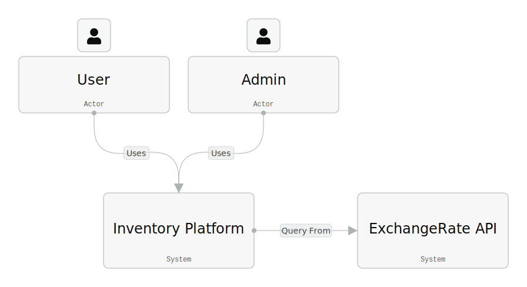
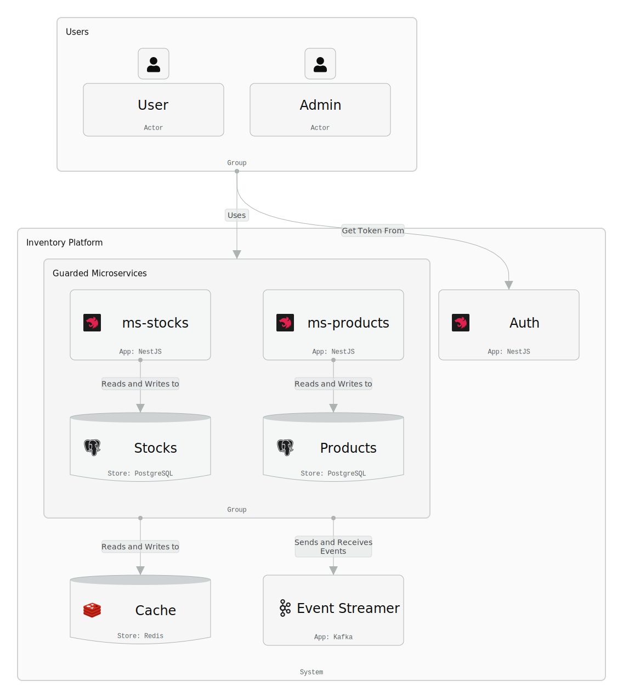
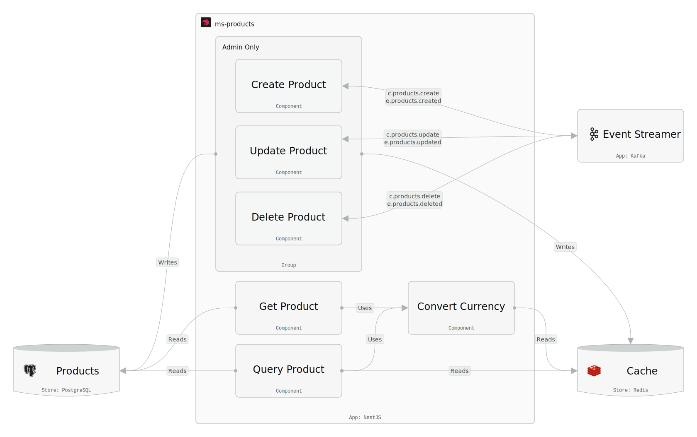
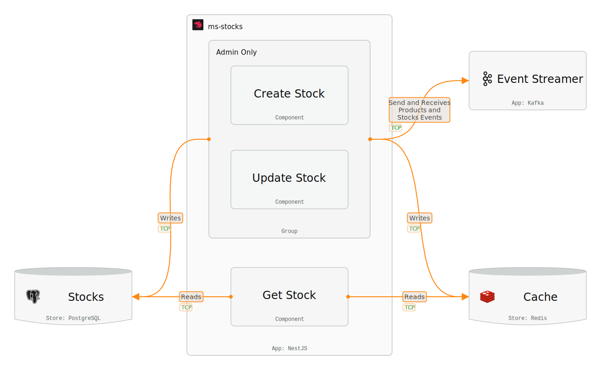
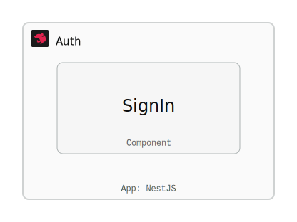

# Inventory Platform

[](https://nestjs.com/)
[](https://www.typescriptlang.org/)
[](https://nodejs.org/)
[](https://www.postgresql.org/)
[](https://kafka.apache.org/)
[](https://redis.io/)
[](https://www.docker.com/)

## Descripcion

Solución diseñada para optimizar la gestión de inventarios con el objetivo de facilitar el control de productos en un almacén, 
permitiendo realizar operaciones como agregar, actualizar, eliminar y consultar información de productos de manera eficiente, segura y escalable.

## Requisitos Funcionales

- Crear, actualizar, eliminar y consultar un producto
- Consultar histórico de precios de un producto
- Consultar listado de productos
- Consultar listado de productos filtrado por categoría
- Consultar inventario de un producto
- Incrementar el inventario de un producto
- Reducir el inventario de un producto
- Consultar histórico de movimientos de un producto
- Convertir precios a la moneda deseada

## Arquitectura

### Patrones y Diseños

- **Microservices**: Segregación de funcionalidades del negocio en servicios independientes
- **Event-Driven Design**: Comunicación de servicios mediante la emisión y lectura de eventos
- **Domain Driven Design**: Agrupación de la lógica del negocio por dominios.
- **Listen to Yourself Pattern**: Lectura de eventos emitidos por sí mismo a una cola de eventos
- **REST**: Estándar o lineamientos para la construcciones de APIs

### Tecnologias

- **NestJs**: Framework basado en Node.js para la creación de aplicaciones del lado del servidor.
- **PostgreSQL**: Base de dato relacional basada en el estandar SQL.
- **Apache Kafka**: Almacenamiento distribuido especializado en el almacenamiento de cola de eventos.
- **Redis**: Base de datos In-Memory de alto rendimiento utilizada como capa de cache para aplicaciones.

### Servicios y Actores

- **ms-products**: Microservicio para las operaciones del detalle de los productos
- **ms-stocks**: Microservicio para las operaciones del inventario de los productos
- **Auth**: Microservicio para la autenticación de los usuarios
- **Cache**: Base de Datos In-Memory para ser utilizada como caché
- **Event Streamer**: Servicio para administrar la cola de eventos utilizados como medio de comunicación entre microservicios
- **Products**: Base de datos de productos
- **Stocks**: Base de datos de inventarios
- **User**: Rol de usuario "usuario" con permisos de lectura
- **Admin**: Rol de usuario "administrador" con permisos de lectura y escritura
- **ExchangeRate API**: Sistema externo para consultar tasa de conversiones de monedas

### Comunicacion

#### Eventos

| Nombre | Descripcion | Tipo |
|--------|-------------|------|
| `c.products.create` | Crear producto en la base de datos | Comando |
| `c.products.update` | Actualizar producto en la base de datos | Comando |
| `c.products.delete` | Eliminar producto en la base de datos | Comando |
| `c.stock-movements.create` | Incrementar o Disminuir el inventario de un producto | Comando |
| `e.products.created` | Producto creado en la base de datos | Evento |
| `e.products.updated` | Producto actualizado en la base de datos | Evento |
| `e.products.deleted` | Producto eliminado en la base de datos | Evento |
| `e.stocks.created` | Inventario de un producto creado | Evento |
| `e.stocks.updated` | Inventario de un producto actualizado | Evento |
| `e.stocks.deleted` | Inventario de un producto eliminado | Evento |

#### Endpoints

| Metodo | Path | Descripcion |
|--------|------|-------------|
| GET | `/api/products` | Obtener todos los productos existentes |
| GET | `/api/products?category=category_name` | Obtener productos por categoría específica |
| GET | `/api/products/{id_del_producto}` | Obtener un producto específico por su identificador |
| GET | `/api/stocks/{id_del_producto}` | Consultar stock disponible de un producto |
| GET | `/api/stocks/{id_del_producto}/movements` | Consultar historial de movimientos de inventario |
| POST | `/api/products` | Crear un nuevo producto |
| POST | `/api/stocks/{id_del_producto}/movements` | Aumentar o reducir la cantidad de inventario de un producto |
| POST | `/auth/signin` | Obtener Token |
| PATCH | `/api/products/{id_del_producto}` | Actualizar un producto existente |
| DELETE | `/api/products/{id_del_producto}` | Eliminar un producto por su identificador |

### Diagrama de Contexto

<picture>
  <source media="(prefers-color-scheme: dark)" srcset="./support-files/context-diagram-dark.svg">
  <source media="(prefers-color-scheme: light)" srcset="./support-files/context-diagram-light.svg">
  
</picture>

#### Componentes

| Nombre | Descripción | Tipo |
|--------|-------------|------|
| Admin | Usuario con acceso a todos los servicios de la plataforma | Actor |
| User | Usuario con acceso a los servicios de lectura de la plataforma | Actor |
| Inventory Platform | Plataforma para la gestión de inventario | System |
| ExchangeRate API | Sistema externo para consultar tasa de conversiones de monedas | System |

### Diagrama de Aplicación

<picture>
  <source media="(prefers-color-scheme: dark)" srcset="./support-files/app-diagram-dark.svg">
  <source media="(prefers-color-scheme: light)" srcset="./support-files/app-diagram-light.svg">
  
</picture>

#### Componentes Externos

| Nombre | Descripción | Tipo |
|--------|-------------|------|
| Admin | Usuario con acceso a todos los servicios de la plataforma | Actor |
| User | Usuario con acceso a los servicios de lectura de la plataforma | Actor |
| ExchangeRate API | Sistema externo para consultar tasa de conversiones de monedas | System |

#### Componentes Internos

| Nombre | Descripción | Tipo |
|--------|-------------|------|
| ms-products | Microservicio para las operaciones del detalle de los productos | App |
| ms-stocks | Microservicio para las operaciones del inventario de los productos | App |
| Auth | Microservicio para la autenticación de los usuarios | App |
| Event Streamer | Servicio para administrar la cola de eventos | App |
| Products | Base de datos de productos | Storage |
| Stocks | Base de datos de inventarios | Storage |
| Cache | Base de Datos In-Memory para ser utilizada como caché | Storage |

#### Relación entre componentes

| Desde | Hasta | Descripción |
|-------|-------|-------------|
| ms-products | Products | Obtener y escribir datos relacionados a los productos |
| ms-products | Cache | Obtener y escribir datos relacionados a consultas de información sobre productos |
| ms-products | Event Streamer | Emitir y leer eventos relacionados a los productos |
| ms-products | ExchangeRate API | Consultar tasa de cambio de monedas |
| ms-stocks | Stocks | Obtener y escribir datos relacionados a los inventarios |
| ms-stocks | Cache | Obtener y escribir datos relacionados a consultas de información sobre inventarios |
| ms-stocks | Event Streamer | Emitir y leer eventos relacionados a los productos y los inventarios |
| User | ms-products | Consultar información relacionada a los productos |
| User | ms-stocks | Consultar información relacionada a los inventarios |
| User | Auth | Autenticarse y obtener token para poder realizar consultas |
| Admin | ms-products | Consultar y actualizar información relacionada a los productos |
| Admin | ms-stocks | Consultar y actualizar información relacionada a los inventarios |
| Admin | Auth | Autenticarse y obtener token para poder realizar consultas |

### Diagrama de Componentes - ms-products

<picture>
  <source media="(prefers-color-scheme: dark)" srcset="./support-files/ms-products-component-diagram-dark.svg">
  <source media="(prefers-color-scheme: light)" srcset="./support-files/ms-products-component-diagram-light.svg">
  
</picture>

#### Componentes Externos

| Nombre | Descripción | Tipo |
|--------|-------------|------|
| Event Streamer | Gestor de cola de eventos | App |
| Products | Base de datos de productos | Store |
| Cache | Base de datos In-Memory usada como caché | Store |
| ExchangeRate API | Sistema externo para consultar tasa de conversiones de monedas | System |

#### Componentes Internos

| Nombre | Descripción |
|--------|-------------|
| Create Product | Crear un nuevo producto en la base de datos |
| Update Product | Actualizar un producto en la base de datos |
| Delete Product | Borrar un producto en la base de datos |
| Get Product | Obtener un producto existente |
| Query Product | Obtener un listado de producto que con o sin filtros aplicados |
| Convert Currency | Obtener la tasa de conversión de una moneda |

#### Flujos

##### Create Product

1. Leer solicitud de creación de producto desde `POST /api/products`
2. Emitir evento `c.products.create` a la cola de eventos
3. Leer evento `c.products.create` desde la cola de eventos
4. Crear producto en la base de datos
5. Emitir evento `e.products.created` a la cola de eventos
7. Leer evento `e.products.created` desde la cola de eventos
8. Actualizar caché
9. Fin

##### Update Product

1. Leer solicitud de actualización de producto desde `PATCH /api/products/{id_del_producto}`
2. Emitir evento `c.products.update` a la cola de eventos
3. Leer evento `c.products.update` desde la cola de eventos
4. Actualizar producto en la base de datos
5. Emitir evento `e.products.updated` a la cola de eventos
6. Leer evento `e.products.updated` desde la cola de eventos
7. Actualizar caché
8. Fin

##### Delete Product

1. Leer solicitud de borrado de producto desde `DELETE /api/products/{id_del_producto}`
2. Emitir evento `c.products.delete` a la cola de eventos
3. Leer evento `c.products.delete` desde la cola de eventos
4. Eliminar producto en la base de datos
5. Emitir evento `e.products.deleted` a la cola de eventos
6. Leer evento `e.products.deleted` desde la cola de eventos
7. Actualizar caché
8. Fin

##### Get Product

1. Leer solicitud de consulta de un producto desde `GET /api/products/{id_del_producto}`
2. Si el producto coincide con los datos en caché:
    1. Consultar producto desde la caché
    2. Si requiere conversión de moneda:
        1. Solicitar conversión al componente `Convert Currency`
        2. Actualizar respuesta con la moneda convertida
    3. Retornar respuesta
    4. Fin
3. Consultar producto desde la base de datos
4. Si solicita conversión de moneda:
    1. Solicitar conversión al componente `Convert Currency`
    2. Actualizar respuesta con la moneda convertida
5. Retornar respuesta
6. Fin

##### Query Product

1. Leer solicitud consulta de productos desde `GET /api/products`
2. Si los filtros de búsqueda coinciden con los datos en caché:
    1. Consultar productos desde la caché
    2. Si requiere conversión de moneda:
        1. Solicitar conversión al componente `Convert Currency`
        2. Actualizar respuesta con la moneda convertida
    3. Retornar respuesta
    4. Fin
3. Consultar productos desde la base de datos con los filtros aplicados
6. Si requiere conversión de moneda:
    1. Solicitar conversión al componente `Convert Currency`
    2. Actualizar respuesta con la moneda convertida
7. Retornar respuesta
8. Fin

##### Convert Currency

1. Leer solicitud de conversión de moneda desde otros componentes internos
2. Consultar la tasa de conversión en la caché
3. Si existe en la caché:
    1. Aplicar conversión con resultado de la caché
    2. Retornar el valor convertido
    3. Fin
4. Consultar `ExchangeRate API`
5. Guardar resultado en caché
6. Aplicar conversión
7. Retornar el valor convertido
8. Fin

### Diagrama de Componentes - ms-stocks

<picture>
  <source media="(prefers-color-scheme: dark)" srcset="./support-files/ms-stocks-component-diagram-dark.svg">
  <source media="(prefers-color-scheme: light)" srcset="./support-files/ms-stocks-component-diagram-light.svg">
  
</picture>

#### Componentes Externos

| Nombre | Descripción | Tipo |
|--------|-------------|------|
| Event Streamer | Gestor de cola de eventos | App |
| Stocks | Base de datos de inventarios | Store |
| Cache | Base de datos In-Memory usada como caché | Store |

#### Componentes Internos

| Nombre | Descripción |
|--------|-------------|
| Create Stock | Crear el inventario de un producto en la base de datos |
| Create Stock Movement | Crear un nuevo movimiento (Entrada o Salida) en el inventario de un producto en la base de datos |
| Update Stock | Actualizar el inventario de un producto en la base de datos |
| Delete Stock | Borrar el inventario de un producto en la base de datos |
| Get Stock | Obtener inventario de un producto |
| Get Stock Movement | Obtener un listado de movimientos de inventario de un producto |

#### Flujos

##### Create Stock

1. Leer evento `e.products.created` desde la cola de eventos
2. Crear inventario del producto
3. Emitir evento `e.stocks.created` a la cola de eventos
4. Leer evento `e.stocks.created` desde la cola de eventos
5. Actualizar la caché
6. Fin

##### Create Stock Movement

1. Leer solicitud de creación de Entrada/Salida del inventario de un producto desde `POST /api/stocks/{id_del_producto}/movements`
2. Emitir evento `c.stock-movements.create` a la cola de eventos
3. Leer evento `c.stock-movements.create` desde la cola de eventos
4. Crear movimiento de inventario del producto en la base de datos
5. Actualizar inventario en la base de datos
6. Emitir evento `e.stocks.updated` a la cola de eventos
7. Leer evento `e.stocks.updated` desde la cola de eventos
8. Actualizar caché
9. Fin

##### Update Stock

1. Leer evento `e.products.updated` desde la cola de eventos
2. Actualizar detalle del inventario del producto en la base de datos
3. Emitir evento `e.stocks.updated` a la cola de eventos
4. Leer evento `e.stocks.updated` desde la cola de eventos
5. Actualizar caché
6. Fin

##### Delete Stock

1. Leer evento `e.products.deleted` desde la cola de eventos
2. Eliminar inventario del producto en la base de datos
3. Emitir evento `e.stocks.deleted` a la cola de eventos
4. Leer evento `e.stocks.deleted` desde la cola de eventos
5. Actualizar caché
6. Fin

##### Get Stock

1. Leer solicitud de consulta de inventario de un producto desde `GET /api/stocks/{id_del_producto}`
2. Si el inventario del producto coincide con los datos en caché:
    1. Consultar inventario del producto desde la caché
    2. Retornar respuesta
    3. Fin
3. Consultar el inventario del producto desde la base de datos
4. Retornar respuesta
5. Fin

##### Get Stock Movement

1. Leer solicitud de consulta de movimientos de inventario de un producto desde `GET /api/stocks/{id_del_producto}/movements`
2. Consultar movimientos de inventario del producto desde la base de datos
3. Retornar respuesta

---

### Diagrama de Componente - Auth

<picture>
  <source media="(prefers-color-scheme: dark)" srcset="./support-files/auth-component-diagram-dark.svg">
  <source media="(prefers-color-scheme: light)" srcset="./support-files/auth-component-diagram-light.svg">
  
</picture>

#### Componentes Internos

| Nombre | Descripción |
|--------|-------------|
| SignIn | Autenticar y obtener token para los usuarios |

#### Flujos

##### SignIn

1. Leer solicitud de creación de token desde `POST /auth/signin`
2. Si los datos no son válidos
    1. Retornar mensaje de error
    2. Fin
3. Retornar nuevo token
4. Fin

## Configuracion

### Prerequisitos

- **Docker Engine**: Version 20.10+

### How To

1. Clonar el proyecto

```bash
  git clone <url-del-proyecto>
```

2. Ejecutar docker-compose en la raiz del proyecto

```bash
  docker compose up
```

3. Ejecutar los endpoints documentos mas adelante

## API Overview

### Products

- **Default Url**: [http://localhost:3000/api/products](<http://localhost:3000/api/products>)
- **Base path**: `/api/products`
- Authentication: Bearer Token

#### Crear un nuevo producto

```http
POST /api/products
```

##### cURL

```curlrc
curl --location 'http://localhost:3000/api/products' \
--header 'Content-Type: application/json' \
--header 'Authorization: Bearer {token}' \
--data '{
  "name": "product_name",
  "description": "product_description",
  "price": 14.99,
  "categories": ["category1", "category2"],
  "sku": "product_sku"
}'
```

##### Respuesta

###### 200 OK

```json
{
  "data": {
    "message": "Product creation request received successfully.",
    "id": "id_to_be_created"
  }
}
```

#### Obtener todos los productos existentes

```http
GET /api/products
```

##### Parametros opcionales

| Nombre | Valor | Descripcion |
|--------|-------|-------------|
| currency | Currency code de ISO 4217. Por ejemplo: USD, DOP, CAD | Obtener el precio del producto convertido a la moneda solicitada |

##### cURL

```curlrc
curl --location 'http://localhost:3000/api/products' \
--header 'Authorization: Bearer {token}'
```

##### Respuesta

###### 200 OK

```json
{
  "data": [
    {
      "id": "1",
      "name": "Product A",
      "description": "This is a great product.",
      "price": 29.99,
      "categories": ["category_name", "other_category"],
      "sku": "PROD-A-001",
      "currency": "DOP"
    },
    {
      "id": "2",
      "name": "Product B",
      "description": "This is another great product.",
      "price": 49.99,
      "categories": ["third_category", "another_category"],
      "sku": "PROD-B-002",
      "currency": "DOP"
    }
  ]
}

```

#### Obtener productos por categoría específica

```http
GET /api/products?category=category_name
```

##### Parametros opcionales

| Nombre | Valor | Descripcion |
|--------|-------|-------------|
| currency | Currency code de ISO 4217. Por ejemplo: USD, DOP, CAD | Obtener el precio del producto convertido a la moneda solicitada |

##### cURL

```curlrc
curl --location 'http://localhost:3000/api/products?category=category_name' \
--header 'Authorization: Bearer {token}'
```

##### Respuesta

###### 200 OK

```json
{
  "data": [
    {
      "id": "1",
      "name": "Product A",
      "description": "This is a great product.",
      "price": 29.99,
      "categories": ["category_name", "other_category"],
      "sku": "PROD-A-001",
      "currency": "DOP"
    },
    {
      "id": "2",
      "name": "Product B",
      "description": "This is another great product.",
      "price": 49.99,
      "categories": ["category_name"],
      "sku": "PROD-B-002",
      "currency": "DOP"
    }
  ]
}
```

#### Obtener un producto específico por su identificador

```http
GET /api/products/{id_del_producto}
```

##### Parametros opcionales

| Nombre | Valor | Descripcion |
|--------|-------|-------------|
| currency | Currency code de ISO 4217. Por ejemplo: USD, DOP, CAD | Obtener el precio del producto convertido a la moneda solicitada |
| priceHistory | true | Incluir el historico de precios del producto |

##### cURL

```curlrc
curl --location --globoff 'http://localhost:3000/api/products/{id_del_producto}' \
--header 'Authorization: Bearer {token}'
```

##### Respuesta

###### 200 OK - Sin historico de precios

```json
{
  "data": {
    "id": "{id_del_producto}",
    "name": "Product A",
    "description": "This is a great product.",
    "price": 29.99,
    "categories": ["category_name", "other_category"],
    "sku": "PROD-A-001",
    "currency": "DOP"
  }
}
```

###### 200 OK - Con historico de precios

```json
{
  "data": {
    "id": "{id_del_producto}",
    "name": "Product A",
    "description": "This is a great product.",
    "price": 29.99,
    "categories": ["category_name", "other_category"],
    "sku": "PROD-A-001",
    "currency": "DOP",
    "priceHistory": [
      {
        "date": "2024-01-01",
        "price": 24.99
      },
      {
        "date": "2024-02-01",
        "price": 27.99
      }
    ]
  }
}
```

#### Actualizar un producto existente

```http
PATCH /api/products/{id_del_producto}
```

##### cURL

```curlrc
curl --location --globoff --request PATCH 'http://localhost:3000/api/products/{id_del_producto}' \
--header 'Content-Type: application/json' \
--header 'Authorization: Bearer {token}' \
--data '{
  "name": "product_name",
  "description": "product_description",
  "price": 14.99,
  "categories": ["category1", "category2"],
  "sku": "product_sku"
}'
```

##### Respuesta

###### 200 OK

```json
{
  "data": {
    "message": "Product update request received successfully.",
    "id": "id_to_be_updated"
  }
}
```

#### Eliminar un producto por su identificador

```http
DELETE /api/products/{id_del_producto}
```

##### cURL

```curlrc
curl --location --globoff --request DELETE 'http://localhost:3000/api/products/{id_del_producto}' \
--header 'Authorization: Bearer {token}'
```

##### Respuesta

###### 200 OK

```json
{
  "data": {
    "message": "Product delete request received successfully.",
    "id": "id_to_be_deleted"
  }
}
```

### Stocks

- **Default Url**: [http://localhost:3001/api/stocks](<http://localhost:3001/api/stocks>)
- **Base path**: `/api/stocks`
- Authentication: Bearer Token

#### Aumentar o reducir la cantidad de inventario de un producto

```http
POST /api/stocks/{id_del_producto}/movements
```

##### cURL

```curlrc
curl --location --globoff 'http://localhost:3001/api/stocks/{id_del_producto}/movements' \
--header 'Content-Type: application/json' \
--header 'Authorization: Bearer {token}' \
--data '{
    "movementType": "movementType",
    "amount": 123
}'
```

##### Constraint

| Propiedad | Valores Validos |
|-----------|-----------------|
| movementType | `IN`, `OUT` |

##### Respuesta

###### 200 OK

```json
{
  "data": {
    "message": "Movement creation request sent"
  }
}
```

#### Consultar stock disponible de un producto

```http
GET /api/stocks/{id_del_producto}
```

##### cURL

```curlrc
curl --location --globoff 'http://localhost:3001/api/stocks/{id_del_producto}' \
--header 'Authorization: Bearer {token}'
```

##### Respuesta

###### 200 OK

```json
{
  "data": {
    "productId": "id_del_producto",
    "productName": "Nombre del producto",
    "stock": 100
  }
}
```

#### Consultar historial de movimientos de inventario

```http
GET /api/stocks/{id_del_producto}/movements
```

##### cURL

```curlrc
curl --location --globoff 'http://localhost:3001/api/stocks/{id_del_producto}/movements' \
--header 'Authorization: Bearer {token}'
```

##### Respuesta

###### 200 OK

```json
{
  "data": {
    "productId": "{id_del_producto}",
    "movements": [
      {
        "quantity": 10,
        "type": "IN",
        "date": "2024-06-01T10:00:00Z"
      },
      {
        "quantity": 5,
        "type": "OUT",
        "date": "2024-06-02T15:30:00Z"
      }
    ]
  }
}
```

### Auth

- **Default Url**: [http://localhost:3002/auth](<http://localhost:3002/auth>)
- **Base path**: `/auth`
- Authentication: No requerida

#### Obtener Token

```http
POST /auth/signin
```

##### cURL

```curlrc
curl --location 'http://localhost:3002/auth/signin' \
--header 'Content-Type: application/json' \
--data '{
    "username": "username",
    "password": "password"
}'
```

###### Usuario `Admin` de Prueba

```json
{
  "username": "user_admin",
  "password": "hashed_password"
}
```

###### Usuario `User` de Prueba

```json
{
  "username": "user_user",
  "password": "hashed_password"
}
```

##### Respuesta

###### 200 OK

```json
{
  "data": {
    "token": "your_token_here"
  }
}
```

###### 401 Unauthorized

```json
{
  "error": "Your credentials are invalid. Please check your username and password and try again."
}
```

## Licencia

No License
